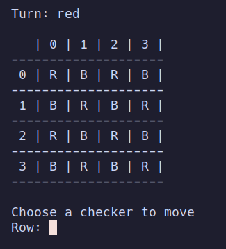
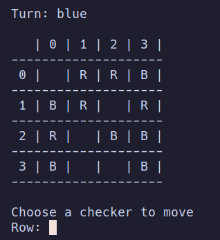
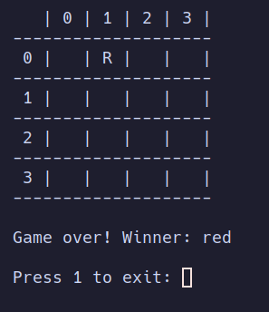
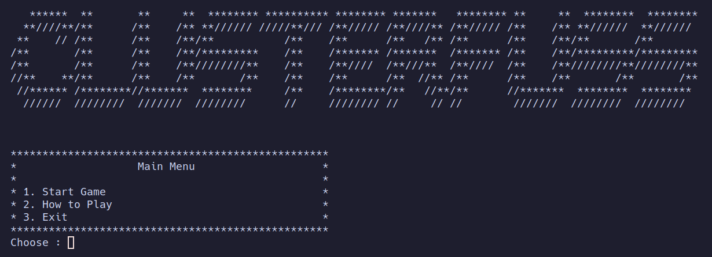
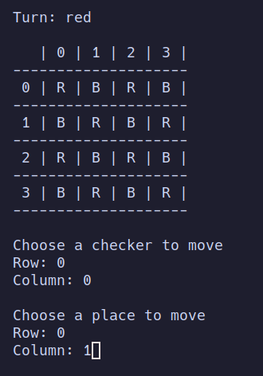

# CLUSTERFUSS
Group Clusterfuss_6

| Name                        | UP                                        | Contribuition |
| ------------                | ------------                              |------------   |
| Joaquim Afonso Marques da Cunha    | up202108779 | 60%           |
| João Pedro Carvalho Correia   | up202005015 | 40%           |

## Installation and Execution

To play Clusterfuss you need to have SICStus Prolog 4.8 or a newer version installed on your machine plus the folder with the source code.

The source code can be extracted from provided zip (`PFL_TP1_T08_Clusterfuss_6.zip`), available on `src` folder.

On the SICStus interpreter, consult the file play.pl.

```
?- consult('play.pl').
```
Run the the predicate play/0 to enter the game main menu:
```
?- play.
```

## Game Description

### Board

This game is played on a NxN board (N needs to be even). The board is filled in every space by red and blue pieces, alternately.

### Gameplay

Clusterfuss is a 2 player game, Red and Blue, and Red starts first.
The objective of the game is to remove all enenmy checkers from the board.
A player can only move one checker per turn and the moves need to be an orthogonal (above, below, right, left) capture.
Passing is not allowed, but if you don't have an available move, your turn is skipped.

This information was taken from Mark Steer's [website](https://marksteeregames.com/Clusterfuss_rules.pdf).

## Game Logic

### Internal Game State Representation

During the execution of the game, the GameState is represented by a list containing 4 lists. Each list represents a row, the second argument represnts who is playing at the moment and the third argument represents the size of the board (NxN).
The `red`/`blue` fields in the lists are the checkers of the players who plays red/blue. The `empty` field represent an empty cell.

#### Initial state (4x4 Board)
```
[[red,blue,red,blue],[blue,red,blue,red],[red,blue,red,blue],[blue,red,blue,red]],red,4
```



#### Intermidiate State (4x4 Board)
```
[[empty,red,red,blue],[blue,red,empty,red],[red,empty,blue,blue],[blue,empty,empty,blue]],blue,4
```



#### Final State (4x4 Board)
```
[[empty,red,empty,empty],[empty,empty,empty,empty],[empty,empty,empty,empty],[empty,empty,empty,empty]],blue,4
```



### Game State Visualization

The main menu is displayed like:




When we start the game, we get displayed the following board:



### Move Validation and Execution

For the move to be valid, the checker needs to capture another checker, friend or foe, and the move needs to be orthogonal (above, below, right, left).
After the move, the board can only have one group. If the move results in deattaching a group of only enemy checkers, the group is removed from the board.

After the validation of the move, the move is executed by update the checker coordinate to `empty` and placing the checker at the coordinations of the capture.
The board is updated and the turn is passed to the other player.

To validate and execute the move we use the predicate

```prolog
move(+GameState, +Move, -NewGameState)
```

The predicate will fail if the move is not valid.

To validate a move we use the predicate

```prolog
is_move_valid(+GameState, +Move)
```

that checks if the checker is the player's and if the move is orthogonal and if the move captures an enemy checker. 
This predicate uses the predicate **is_orthogonal/4** that checks if the move is orthogonal.

Regarding the execution of the move, we use the predicate

```prolog
move_checker(+Board, +Move, -NewBoard)
```

that give us the new board after the move.

After the move validation and execution, we create the new game state using the new board, switching the player turn with **switch_turn/2** predicate and the size of the board.

### List of Valid Moves

To get a list of valid moves we use the predicate

```prolog
valid_moves(+GameState, -Moves)
```

that give us the list of all valid moves for the current player regarding the `GameState`, using **findall/3** and **move/3** predicates.

In our implementation ,mof **valid_moves/2** we don't use the `Player` similarly to the given predicate since we already have the `Turn` in the `GameState` giving
us the current player.

### End of Game

To verify if the game is over we use the predicate

```prolog
game_over(+GameState, -Winner)
```

that checks if the game is over by checking if there is no more enemy checkers on the board. If there is no more enemy checkers, the game is over and the winner is the next turn player since we verify the game over conditions before every turn.

The **game_over/2** predicate is used in the **game_loop/3** predicate. If **game_over/2** succeeds, the game is over and the board, as well as the winner, are printed.

### Game State Evaluation

Since we were not able to implement the group logic, we were not able to implement the game state evaluation.
(See the **Conclusion** section for more details)

### Computer Plays

To choose the computer move we use the predicate

```prolog
choose_move(+GameState, +Player, -Move)
```

having `Player` as `c` to differentiate fro the human player.
The predicate uses **valid_moves/2** to get the list of valid moves and then chooses a random move from the list using the **random_member/2** predicate
from the **random** library. After the move is selected it displays the move to the user.

Regarding the bot using the greedy algorithm, the change to the bot would be to use a predicate to evaluate the board and choose the move that would give the best
result instead of using the **random_member/2** predicate. This bot was not implemented due to the presented reasons in the **Conclusion** section.

## Conclusion

The board game Clusterfuss was not successfully implemented *(details bellow)* in SICStus Prolog 4.8 language. The game can be played Player vs Player, Computer vs Computer or Player vs Computer.
One of the dificulties in this project was the develop of the logic to some exceptions in the moves.
We would've liked to have further time to develop the game and apply more details to it.
Regardless, the development of Clusterfuss was crucial for our knowledge on the Prolog language.

Regarding the not successful parts of this project, we were not able to implement the group validation regarding move restrictions as well as enemy only group removal. The approach we took to the problem was to go through the board given a position, traversing the board with orthogonal moves and storing the positions in a list. If the number of checkers in the group list were not the same as the number of checkers in the board, the move would be invalid.

In case of the enemy only we would use the same method above to get the group list of each enemy checker that we could capture, with the constraint that the checkers were only enemy checkers. If after the capture all other checkers were not in the same group, the group would be removed from the board.
To find out if the checkers were a group before, accounting our checker we would create a temporary board with our checker the same color as the enemy checkers and
find if all orthogonally adjacent checkers were in the same group.

We also failed comming up with a greedy bot because we were not able to implement the group logic, not having a way to correctly evaluate the board.

## Sources

Mark Steer's [website](https://marksteeregames.com/Clusterfuss_rules.pdf)
